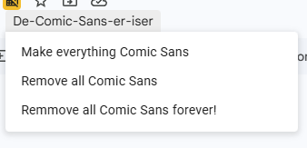

# De-Comic-Sans-Er-Iser

Sometimes, people make bad choices and they're too young to understand what makes them bad.

One of the worst choices a young person can make is to use Comic Sans MS over whatever perfectly sensible font you've added to your task slide. Crimes against typography are a real problem, and this project is here to help.

## How it works

Students are presented with an enticing extra sub-menu. Those most inclined towards typographic vandalism will click on it. Unfortunately for them, all buttons replace their chosen font with Arial.

The more devious amongst them might refuse to authorise the script. Fret not! You can still use the script by running it yourself and the effect will be the same.

Once clicked, all fonts will be reset back to Arial every 5 minutes for the next hour.

## Usage

Open the Google Slides document you wish to protect.

Click `Extensions` -> `App Script` to open the Google Apps Script editor.

Paste the code in [Script.js](Script.js) into your browser's console while on the page where you want to remove Comic Sans MS. It will replace all instances of Comic Sans MS with a more appropriate font, such as Arial or Helvetica.

Refresh the page to see the new menu appear.

Chose any option and authorise the script if prompted.
